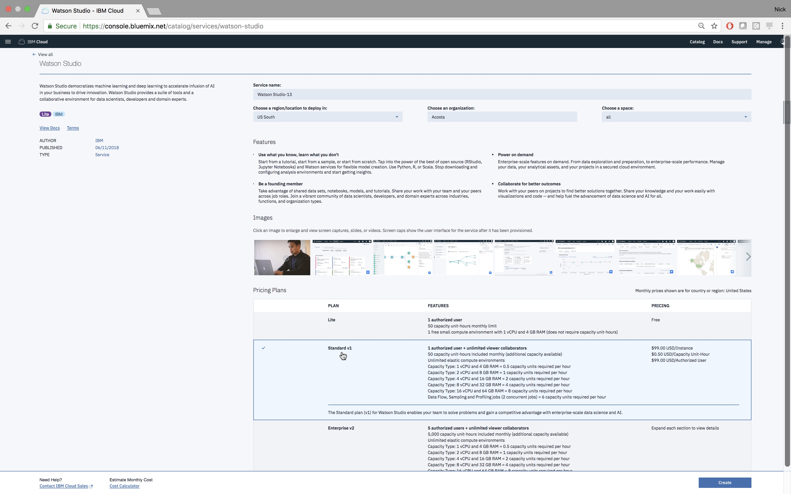

# Horovod

 

 

[Horovod](https://github.com/uber/horovod) is a distributed training framework for TensorFlow, Keras, and PyTorch. The goal of Horovod is to make
distributed Deep Learning fast and easy to use. The following guide is an example showing how to use Horovod to quickly train a neural network.

# Table of Contents 
1. [Sign up for an IBM Cloud account](#signup)
2. [Provision IBM Cloud Services](#provision)
3. [Create Watson Studio Project](#create)
3. [Add data to IBM Cloud Object Storage](#adddata)
4. [Build model with Horovod](#build)
5. [Train model with Horovod](#train)
5. [Results](#results)

## Sign up for an IBM Cloud account  
Registration for IBM Cloud can be done [here](https://console.bluemix.net/registration/?)

## Provision IBM Cloud Services  
Sign into IBM Cloud to see the welcome page below. New services are provisioned by selecting “Catalog.” Search for and select “Watson Studio.”

 

Two services will be need to use Horovod on IBM Cloud: Watson Studio and IBM Cloud Object Storage. Watson Studio . IBM Cloud Object Storage stores training data and neural network model defintions. Watson Studio's Deep Learning service allows data scientists to train large scale neural network models on GPU-clusters, and deploy and manage them as API endpoints. Make sure that the **Standard V1** (or Enterprise V2) plan is being selected for Watson Studio (this will necessary to for training on multiple GPUs with Horovod). Click “Create,” then search for and add a Lite  “Object Storage” services in the Catalog. Once finished, the IBM Cloud logo in the top left should bring you to a page shown below.

|  | 
|:--:| 
| *Be sure to select the Standard v1 Watson Studio plan* |

## Create Watson Studio Project 

Now a new Watson Studio Project will be created that utilizes all the IBM Cloud services just provisioned. Access Watson Studio by selecting the created Watson Studio service from the IBM Cloud dashboard, then select “Get Started” click through prompts. Once in Watson Studio select “New project” on the right. The type of project needed is “Complete.”

Name the new project “DLaaS Workshop.” The IBM Cloud Object Storage service that was provisioned is already associated with our project. Select “Create” at the bottom right.

## Add training data  
Buckets will now be created in the IBM Cloud Object Storage service to so that the mnist training data and model definitions can be store. Please see the notebook [addmnistdata.ipynb](addmnistdata.ipynb) for reference.

## Create model  
This repo's [model directory](models) has two models, one that uses Horovod and Keras and another that does just uses Keras. The [README](models/README.md) highlights the differences between the two notebooks.

## Train model  

## Results  
*coming soon*

